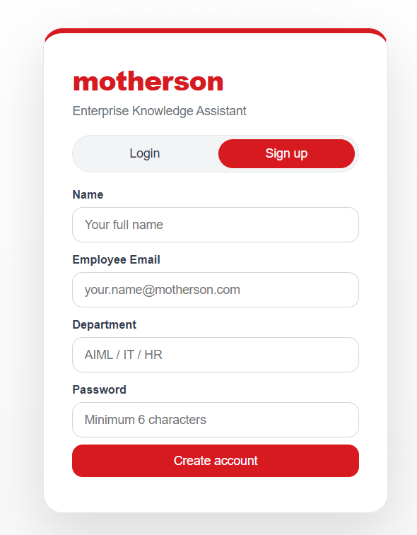
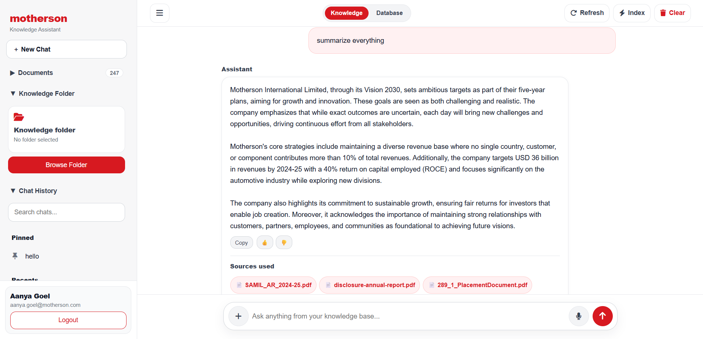
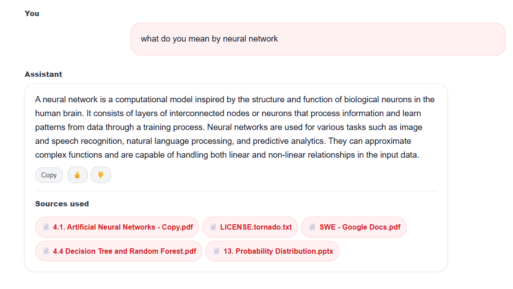
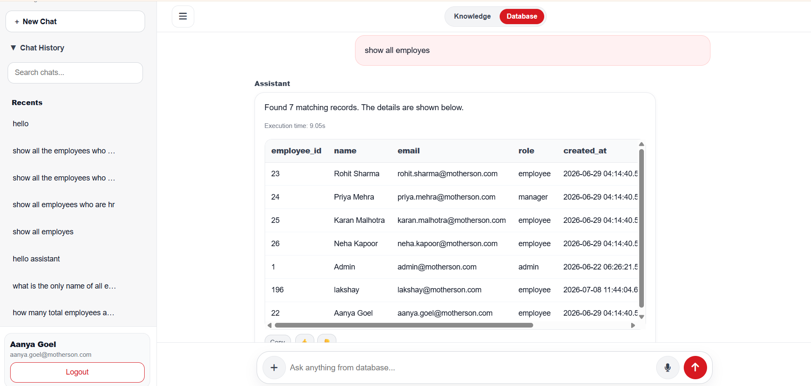
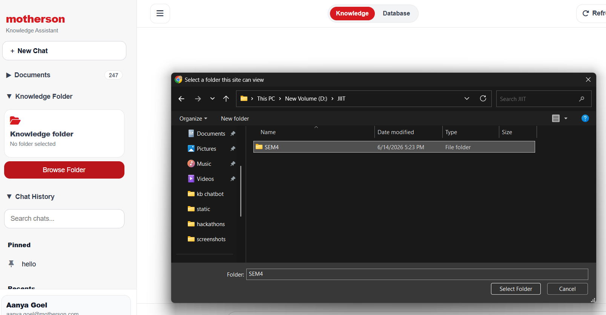

# Enterprise Knowledge & Database Assistant

An enterprise-grade AI assistant that combines **Retrieval-Augmented Generation (RAG)** with **natural language database querying**, enabling employees to retrieve information from internal documents and enterprise databases through a single intelligent interface.

Built with **FastAPI**, **PostgreSQL**, **pgvector**, **Ollama**, and a lightweight responsive frontend.

---

## Overview

Traditional enterprise systems separate document search from structured database queries. This project unifies both workflows into a single AI-powered assistant.

Users can:

- Ask questions about company documents
- Retrieve context-aware answers with source citations
- Query enterprise databases using natural language
- View structured SQL results securely
- Maintain persistent chat history
- Manage document indexing through a clean interface

---

# Features

## Knowledge Assistant

- Hybrid Retrieval-Augmented Generation (Hybrid RAG)
- Semantic document retrieval
- Context-aware responses
- Source citations
- Download referenced documents
- Folder-based document indexing
- Manual indexing support
- Voice input
- Persistent conversations
- Chat pinning & archiving
- Responsive interface

---

## Database Assistant

- Natural Language → SQL
- Secure read-only query execution
- Structured table rendering
- SQL generated automatically
- AI generated summaries
- Copy responses
- Session based conversations

---

## Authentication

- Employee registration
- Login
- Session management
- Protected API routes

---

## Screenshots

### Login



---

### Knowledge Assistant



---

### Knowledge Sources

Every response includes the documents used to generate the answer.



---

### Database Assistant

Ask questions in natural language and retrieve structured data directly from PostgreSQL.



---

### Folder Selection

Browse and index knowledge folders directly from the interface.



---

# Architecture

```
                           User
                            │
                            ▼
                    FastAPI Backend
                            │
        ┌───────────────────┼───────────────────┐
        │                   │                   │
        ▼                   ▼                   ▼
 Authentication      Knowledge Service    Database Service
        │                   │                   │
        │            Hybrid RAG Engine      PostgreSQL
        │                   │
        │              pgvector Search
        │                   │
        │              Ollama LLM
        │
        ▼
 Session Management
```

---

# Technology Stack

## Backend

- FastAPI
- Python
- PostgreSQL
- pgvector

## AI

- Ollama
- Hybrid RAG
- Semantic Search
- Sentence Transformers

## Frontend

- HTML
- CSS
- JavaScript

## Database

- PostgreSQL
- pgvector

---

# Project Structure

```
enterprise-knowledge-assistant/

│
├── app/
│   ├── api/
│   ├── config/
│   ├── core/
│   ├── database/
│   ├── models/
│   ├── services/
│   └── utils/
│
├── static/
│   ├── css/
│   ├── js/
│   └── kb_chat.html
│
├── knowledge_base/
├── logs/
│
├── main.py
├── requirements.txt
├── README.md
└── .env.example
```

---

# Installation

## Clone the repository

```bash
git clone https://github.com/aanyagoel26/knowledgebase-chatbot.git

cd enterprise-knowledge-assistant
```

---

## Create Virtual Environment

```bash
python -m venv venv
```

Windows

```bash
venv\Scripts\activate
```

Linux / macOS

```bash
source venv/bin/activate
```

---

## Install Dependencies

```bash
pip install -r requirements.txt
```

---

## Configure Environment

Create a `.env` file based on:

```
.env.example
```

Configure:

- PostgreSQL credentials
- Ollama endpoint
- Vector database settings

---

## Run

```bash
uvicorn main:app --reload
```

Application will start at

```
http://127.0.0.1:8000
```

---

# Workflow

```
User Question

      │

      ▼

FastAPI API

      │

      ├───────────────┐
      │               │

Knowledge        Database

      │               │

Hybrid RAG    SQL Generator

      │               │

Ollama      PostgreSQL

      │               │

      └───────Answer──┘
```

---

# Key Features

- Hybrid RAG
- Semantic Search
- Natural Language SQL
- Enterprise Authentication
- PostgreSQL Integration
- pgvector Support
- Voice Input
- Source Citations
- Folder Indexing
- Manual Re-indexing
- Chat History
- Chat Pinning
- Chat Archiving
- Responsive Design
- Secure API
- Download Referenced Documents

---

# API Overview

## Authentication

```
POST /signup
POST /login
POST /logout
```

---

## Knowledge

```
POST /chat
POST /upload
POST /index-now

GET /documents
GET /knowledge-folder
GET /index-status
```

---

## Database

```
POST /database-chat
```

---

## Sessions

```
GET /sessions
POST /sessions/pin
POST /sessions/archive
DELETE /sessions
```

---

# Security

- Session-based authentication
- Protected API routes
- Read-only database assistant
- Local document processing
- Local LLM inference using Ollama
- Environment variable based configuration

---

# Future Improvements

- Streaming AI responses
- Multi-user role based access control
- Single Sign-On (SSO)
- Document versioning
- Advanced analytics dashboard
- Docker deployment
- Kubernetes support
- CI/CD pipeline

---

# Author

## Aanya Goel

Built as a full-stack enterprise AI assistant integrating Retrieval-Augmented Generation with intelligent database querying using FastAPI, PostgreSQL, pgvector and Ollama.

---

# License

This repository is intended for educational and portfolio purposes.

Please ensure that any company-specific branding, documents or proprietary information are removed before public distribution.
